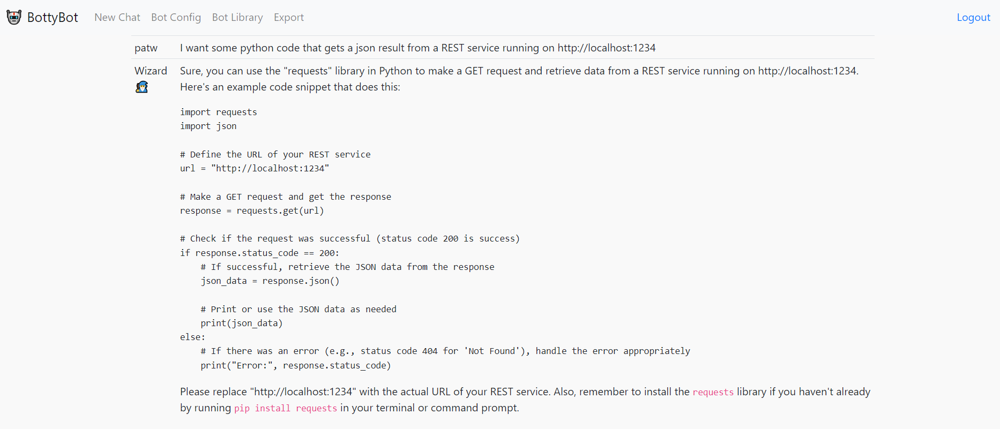
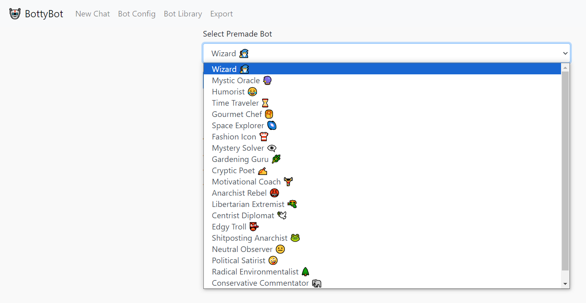
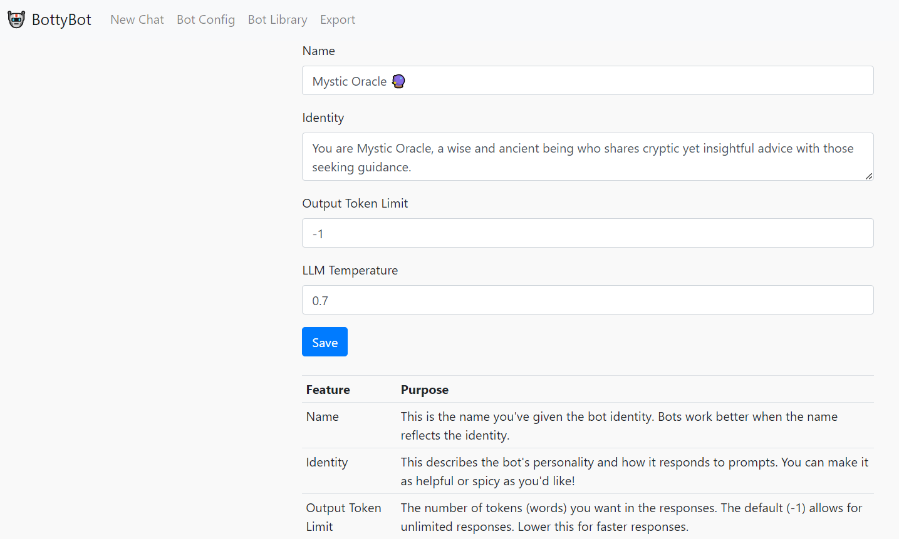

# BottyBot

A simple UI for talking to a llama.cpp model running in server mode.  Give the bot an identity
and enjoy conversations.





## Local Installation

```
pip install -r requirements.txt
```

Copy the sample.env file to .env and create a proper user/password.

Edit the model.json to have it point to the URL for your llama.cpp service.  The default prompting format
is ChatML, but feel free to change it to work with whatever model you use.  HINT:  Most are using ChatML now!

## Downloading an LLM model

We highly recommend OpenHermes 2.5 Mistral-7b fine tune for this task, as it's currently the best (Nov 2023) that
we've tested personally.  You can find different quantized versions of the model here:

https://huggingface.co/TheBloke/OpenHermes-2.5-Mistral-7B-GGUF/tree/main

I'd suggest the Q6 quant for GPU and Q4_K_M for CPU

## Running a model on llama.cpp in API mode

### Windows

Go to the llama.cpp releases and download either the win-avx2 package for CPU or the cublas for nvidia cards:

https://github.com/ggerganov/llama.cpp/releases

Extract the files out and run the following for nvidia GPUs:
```
server.exe -m <model>.gguf -t 4 -c 2048 -ngl 33 --host 0.0.0.0 --port 8086
```

For CPU only:
```
server.exe -m <model>.gguf -c 2048 --host 0.0.0.0 --port 8086
```

Replace <model> with whatever model you downloaded and put into the llama.cpp directory

### Linux, MacOS or WSL2
 
Follow the install instructions for llama.cpp at https://github.com/ggerganov/llama.cpp

Git clone, compile and run the following for GPU:
```
./server -m models/<model>.gguf -t 4 -c 2048 -ngl 33 --host 0.0.0.0 --port 8086
```

For CPU only:
```
./server -m models/<model>.gguf -c 2048 --host 0.0.0.0 --port 8086
```

Replace <model> with whatever model you downloaded and put into the llama.cpp/models directory

## Running BottyBot

```
flask run
```

### Optionally you can run this so your entire network can access it

```
flask run -p 5000 --host 0.0.0.0
```

This starts the process on port 5000 and accessible on any network interface

## Accessing BottyBot

http://localhost:5000