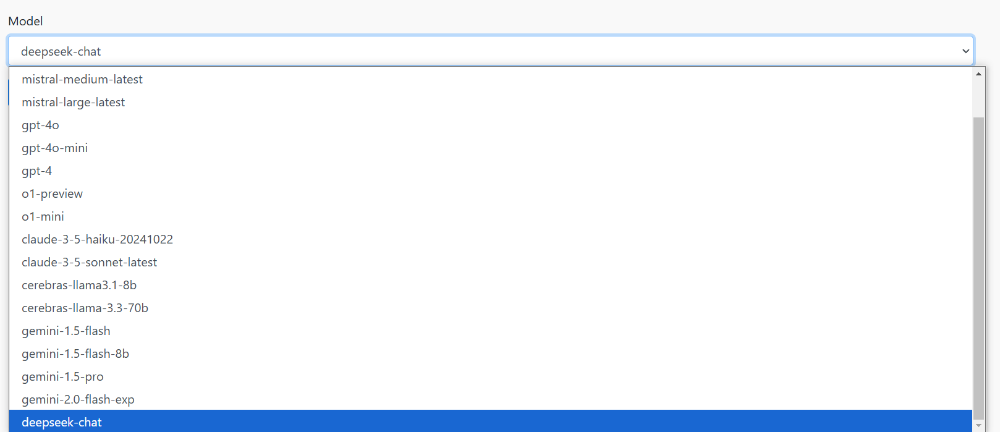

# BottyBot


A simple UI for debugging prompts across multiple models.  Supports local models (llama.cpp server or ollama server), as well as OpenAI, Anthropic, Deepseek, Google Gemini, Mistral and Cerebras.  Supports loadable system messages for bot identity.




## Local Installation

```
pip install -r requirements.txt
```

## Docker Installation

```
git pull https://github.com/patw/Bottybot.git
cd Bottybot
```

Follow the instructions below on configuring the .env and model.json

```
docker build -t bottybot .
docker run -d -p 7860:5000 bottybot
```

## Configuration

Copy the sample.env file to .env and create a proper user/password.  Add API keys for various providers, but be sure to remove the saample keys for ones you are not currently using!  LOCAL_MODELS takes dict values of "local-<model name>": "<url endpoint for llama.cpp or ollama server>"

## Downloading an LLM model

The easiest way to do this is with ollama, consult their documentation on downloading a model. 

## Running BottyBot

```
flask run
```

### Optionally you can run this so your entire network can access it

```
flask run -p 5000 --host 0.0.0.0
```

This starts the process on port 5000 and accessible on any network interface

## Accessing BottyBot

http://localhost:5000